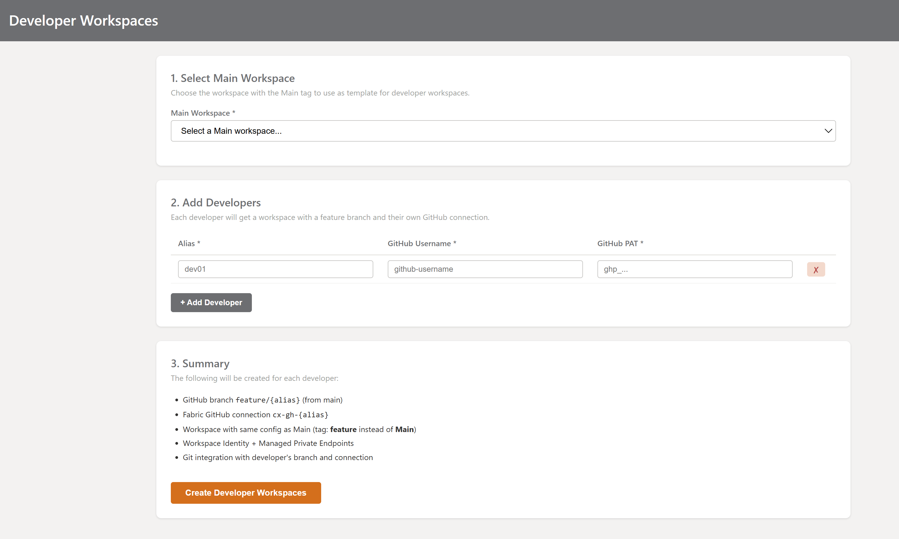
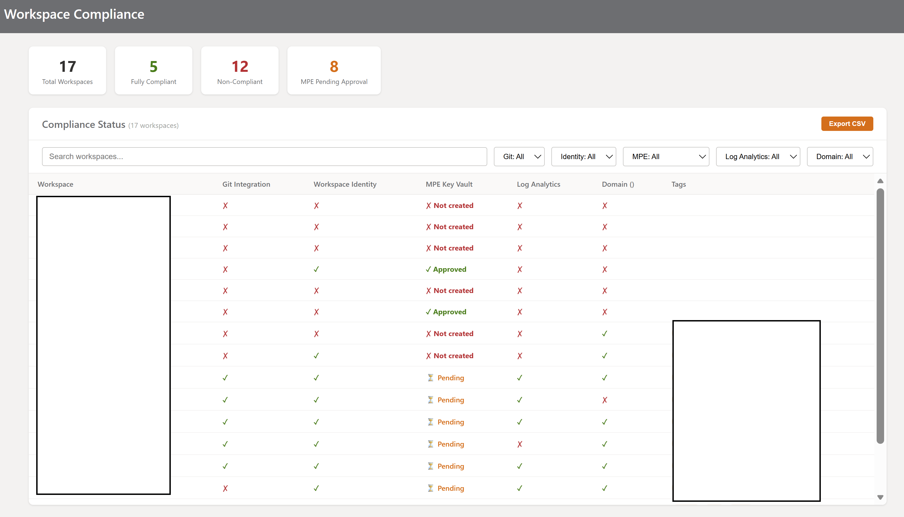
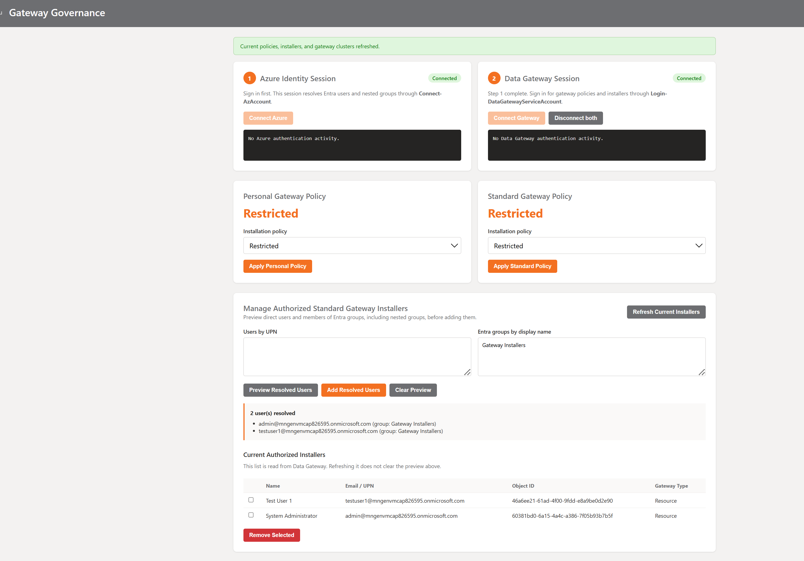

# Fabric Governance Hub

> **Provision, govern, and visualize your Microsoft Fabric workspaces — in minutes, not hours.**

As your Fabric environment grows, so does the need for consistent, repeatable workspace management. **Fabric Workspace Manager** brings together workspace provisioning, governance, and visualization into a single streamlined experience — helping your team move faster while keeping everything organized.

---

## Who is this for?

- **Fabric Administrators** who want to streamline workspace provisioning across teams
- **Platform Engineers** building standardized data environments across use cases
- **Data Governance Teams** ensuring consistent tagging, domain assignments, and access controls
- **Anyone** looking to accelerate and simplify Fabric workspace management at scale

---

## What can it do?

### Create Workspace — Full Provisioning in One Click
Everything your workspace needs, configured from the start: capacity, domain, tags, exclusive Log Analytics or Fabric Workspace Monitoring, role assignments, workspace identity, managed private endpoints, initial folders, notebooks, pipelines, lakehouse, and GitHub integration — all in a single, guided experience.


### Modify Workspaces — Batch Operations at Scale
Select multiple workspaces and apply changes in bulk: **apply or remove tags**, **assign domains**, **reassign capacity**, or **delete** — all in one streamlined operation, saving time and ensuring consistency.

Workspace deletion includes a server-generated impact review listing every managed private endpoint. After explicit confirmation, the app refreshes that inventory, deletes and verifies each endpoint, performs a final zero-endpoint check, and only then deletes its workspace. Processing stops on the first failure; completed workspace IDs are retained so the operation can be reviewed and safely retried without repeating successful deletions.


### Developer Workspaces — Isolated Environments for Every Developer
Create developer workspaces from a Main workspace template. Each developer receives an isolated Fabric workspace, a dedicated feature branch, and an individual GitHub connection while preserving the template's configuration, identity, and managed private endpoints.



### Workspace Map — See Your Entire Landscape
Get a **visual overview** of every workspace in your tenant, organized by domain and classified by type (PII, Reference Assets, Use Case). Filter by environment, use case, branch, and capacity to instantly understand your workspace topology.


### Workspace Compliance — Governance at a Glance
Check every workspace against compliance requirements: **Git integration**, **Workspace Identity**, **Managed Private Endpoints** (with approval status), **Log Analytics**, and **Domain assignment**. Filter by any compliance dimension, export to CSV, and track KPIs for compliant vs non-compliant workspaces.



### Gateway Governance — Control Tenant-Wide Gateway Access
Review and update personal and standard gateway installation policies, manage authorized standard gateway installers, and inspect registered gateway clusters. The module resolves Entra users and nested groups before applying changes. In Azure, user and group resolution preserves the signed-in administrator's delegated identity while Data Gateway operations use a dedicated service principal.



### Settings — Configure Once, Use Everywhere
Define tag groups (Environment, Branch), managed private endpoint resource IDs, monitoring policy, and compliance rules in one place. Monitoring can be optional or mandatory; workspace creation permits exactly one of no monitoring, Log Analytics, or Fabric Workspace Monitoring.

Fabric Workspace Monitoring creates the managed monitoring Eventhouse and KQL database, then enables workspace activity ingestion. Settings must contain the regional `analysis.windows.net` metadata cluster URL used by the Fabric portal. This integration currently relies on that portal metadata endpoint because it is not included in the public Fabric REST specification. After creation, pausing logging, deleting the monitoring Eventhouse, or changing monitoring providers is managed from **Fabric Workspace settings > Monitoring**.


### Tenant Overview — Everything at a Glance
Capacities, workspaces, domains, subdomains, tags, gateways (with contact info and users), connections — all visible in a single dashboard with filters, search, and CSV export.


---

## Key Capabilities

| Feature | Description |
|---------|-------------|
| **Workspace Provisioning** | Create workspaces with capacity, domain, tags, roles, and initial items in a single step |
| **Workspace Identity** | Automatically provisions a managed identity for each new workspace |
| **Managed Private Endpoints** | Creates Key Vault and Cognitive Services MPEs for secure outbound connectivity |
| **Initial Items** | Auto-create folder structure (Notebook, Pipeline), notebooks (`nb_00_init`), pipelines (`p_00_init`), and Lakehouse |
| **Nested Root Folders** | Support for nested folder paths like `Project/SubProject/` |
| **Tag Management** | Create tags on the fly, apply/remove in batch; Use Case tags loaded dynamically from domain |
| **Domain Assignment** | Assign workspaces to domains and subdomains individually or in bulk |
| **Workspace Monitoring** | Select exactly one of Log Analytics or Fabric Workspace Monitoring during creation, with an optional mandatory policy from Settings |
| **Role Assignments** | Pre-defined Entra ID security groups per role (Admin, Contributor, Viewer) |
| **Git Integration** | Connect workspaces to GitHub with auto-creation of git folders via GitHub API |
| **Developer Workspaces** | Create feature workspaces for developers from a Main template with individual GitHub branches and connections |
| **Workspace Compliance** | Check compliance for Git, Identity, MPE, Log Analytics, and Domain — with filters and CSV export |
| **Gateway Governance** | Manage tenant gateway policies, authorized installers, nested Entra groups, and gateway cluster inventory |
| **Workspace Map** | Visual governance dashboard with domain grouping and PII/Reference Assets classification |
| **Tenant Overview** | Dashboard with KPIs, filters, and CSV export for workspaces and gateways |
| **Separated Authentication** | Delegated user tokens for Fabric, Power BI, Graph, and Azure identity operations; a dedicated service principal for Data Gateway administration |
| **Batch Operations** | Apply tags, remove tags, assign domain, assign capacity, and safely delete workspaces after verified MPE cleanup |

---

## Getting Started

### Prerequisites
- Python 3.12+
- PowerShell 7.4+
- PowerShell modules: `Az.Accounts`, `Az.Resources`, `DataGateway.Profile`, and `DataGateway` for local execution
- A Microsoft Entra ID account with Fabric workspace admin permissions
- Appropriate Fabric, Power BI, Microsoft Graph, Azure, and Power Platform gateway administration permissions
- A Fabric tenant with at least one capacity

### Local Installation

```bash
git clone <repo-url>
cd fabric-governance-hub
pip install -r infra/requirements.azure.txt
```

Install the pinned PowerShell modules or use the versions declared in `infra/Dockerfile`.

### Local Configuration

Create a `.env` file:

```env
FABRIC_TENANT_ID=your-tenant-id
GITHUB_PAT=your-github-personal-access-token
FLASK_SECRET_KEY=your-random-development-key
```

- `FABRIC_TENANT_ID`: Microsoft Entra tenant ID.
- `GITHUB_PAT`: optional GitHub Personal Access Token with `repo` scope.
- `FLASK_SECRET_KEY`: random value used to protect the Flask session.

Do not commit `.env` or any credential values.

### Run Locally

```bash
python app.py
```

When `ENTRA_WEB_CLIENT_ID` and `ENTRA_WEB_CLIENT_SECRET` are absent, the application uses device-code authentication. Azure identity and Data Gateway sessions also fall back to device code when delegated tokens or service-principal credentials are unavailable.

Then open **http://127.0.0.1:5000** in your browser.


---

## Authentication Model

The application deliberately separates interactive user authorization, Azure workload identity, and Data Gateway administration.

| Identity | Used for | Authentication flow |
|----------|----------|---------------------|
| **Signed-in administrator** | Fabric, Power BI, Microsoft Graph, and Azure/Entra user and group resolution | Container Apps built-in authentication (Easy Auth), followed by MSAL On-Behalf-Of (OBO) for downstream delegated tokens |
| **Gateway service principal** | Gateway tenant policy, authorized installer, and gateway cluster operations | OAuth 2.0 client credentials through `Login-DataGatewayServiceAccount` |
| **Container App managed identity** | Pulling images from ACR and accessing Azure resources assigned through RBAC | User-assigned managed identity |
| **Token rotation job identity** | Rotating the Easy Auth token-store SAS and restarting the target revision | User-assigned managed identity with narrowly scoped Azure roles |
| **GitHub PAT** | Optional GitHub repository and folder operations | Secret-backed personal access token |

### Hosted User Authentication

Azure Container Apps authentication protects every route and redirects unauthenticated users to Microsoft Entra ID. Access is restricted to the configured administrator group.

1. Easy Auth signs in the administrator and provides the user access token in the `X-MS-TOKEN-AAD-ACCESS-TOKEN` header.
2. The Flask application uses the confidential web application registration to exchange that assertion through MSAL OBO.
3. The resulting delegated token is scoped independently for Fabric, Power BI, or Microsoft Graph.
4. Azure identity operations pass delegated Azure and Graph tokens to the isolated `Az` PowerShell host.
5. When the user assertion expires, the application redirects through `/auth/refresh-session` to renew the Easy Auth session.

The Entra web application registration must:

- Expose the delegated scope `api://<client-id>/user_impersonation`.
- Have the redirect URI required by Container Apps authentication.
- Include delegated permissions for the Fabric, Power BI, and Microsoft Graph operations used by the application.
- Receive administrator consent where the tenant requires it.

### Gateway Service Principal

Gateway Governance does not reuse the signed-in user's token for Data Gateway commands. Configure a dedicated Entra application and enterprise service principal using:

```env
DATA_GATEWAY_CLIENT_ID=your-gateway-application-client-id
DATA_GATEWAY_CLIENT_SECRET=your-gateway-client-secret-value
```

The service principal must be authorized in the Power BI/Fabric tenant settings and included directly in the configured security group where service-principal API access is restricted. Use the **enterprise application object ID** for group membership checks, not the application registration object ID.

`scripts/gateway_governance_host.ps1` converts the secret value to `SecureString` and calls:

```powershell
Login-DataGatewayServiceAccount `
  -ApplicationId $env:DATA_GATEWAY_CLIENT_ID `
  -ClientSecret $secureClientSecret `
  -Tenant $tenantId
```

An `AADSTS7000215` response occurs before Gateway API authorization and normally indicates an incorrect, stale, or not-yet-propagated client secret. Always validate a rotated credential with a direct client-credentials token request before troubleshooting Gateway permissions.

### Isolated PowerShell Sessions

`gateway_session.py` maintains two independent long-running PowerShell processes to prevent module and authentication context conflicts:

1. `scripts/azure_identity_host.ps1` uses delegated Azure and Graph tokens in Azure, or device code locally, to resolve users and recursively expand nested groups.
2. `scripts/gateway_governance_host.ps1` uses the dedicated Gateway service principal in Azure, or device code locally, for Data Gateway administration.

---

## Azure Infrastructure

Infrastructure is defined in Bicep under `infra/` and deployed at subscription scope. The main template creates a dedicated resource group and composes focused modules.

| Resource | Purpose |
|----------|---------|
| **Azure Container Apps** | Runs Flask through Gunicorn with one replica, health probes, HTTPS-only ingress, Easy Auth, and single-revision traffic |
| **Container Apps Environment** | Hosts the application inside the delegated Container Apps subnet |
| **Azure Container Registry** | Stores the application image; the app pulls through managed identity |
| **User-assigned managed identities** | Separate application and token-rotation workload identities |
| **Azure Key Vault** | Stores deployment secrets with RBAC authorization, soft delete, and public network access disabled |
| **Azure App Configuration** | Stores shared, non-secret governance settings with optimistic concurrency |
| **Storage account** | Private Blob container used by the Easy Auth token store; shared-key access and public access are disabled |
| **Log Analytics and Application Insights** | Centralized logs, metrics, requests, dependencies, and application telemetry |
| **Virtual network** | `10.40.0.0/16` with a delegated Container Apps subnet and a separate private-endpoint subnet |
| **Private endpoints and DNS** | Private access for ACR, Key Vault, App Configuration, Blob Storage, Log Analytics, and Application Insights/Azure Monitor |
| **Container Apps job** | Periodically rotates the Easy Auth token-store SAS and restarts the application revision |

### Network Layout

```text
vnet-fabric-gov-<environment>
├── snet-container-apps       10.40.0.0/23
│   └── Container Apps Environment
└── snet-private-endpoints    10.40.2.0/24
    ├── Azure Container Registry private endpoint
    ├── Key Vault private endpoint
    ├── App Configuration private endpoint
    ├── Blob Storage private endpoint
    └── Azure Monitor private endpoints
```

Private DNS zones are linked to the application VNet. Administrative access from a jumpserver or another VNet requires peering and a link to the relevant private DNS zone, such as `privatelink.vaultcore.azure.net` for Key Vault or `privatelink.azconfig.io` for App Configuration. Set `adminVirtualNetworkId` to the resource ID of the administrative VNet to create the App Configuration DNS link during deployment.

### Managed Identity and RBAC

The Bicep deployment assigns least-privilege roles:

- Application identity: `AcrPull` on the registry.
- Application identity: `Key Vault Secrets User` on the vault.
- Application identity: `App Configuration Data Owner` on the configuration store.
- Application identity: `Storage Blob Data Contributor` for the Easy Auth token store.
- Deployer: `Key Vault Secrets Officer` on the vault.
- Rotation job identity: scoped Storage, Container Apps, Container Apps Environment, and Managed Identity roles required to rotate the SAS and restart the target revision.

The Gateway service principal is separate from these Azure managed identities and is not used to access ACR, Key Vault, App Configuration, or Storage.

### Secrets and Configuration

| Setting | Secret | Purpose |
|---------|--------|---------|
| `FABRIC_TENANT_ID` | No | Tenant used by all Entra authentication flows |
| `ENTRA_WEB_CLIENT_ID` | No | Easy Auth/OBO web application client ID |
| `ENTRA_WEB_CLIENT_SECRET` | Yes | Confidential client credential for OBO |
| `DATA_GATEWAY_CLIENT_ID` | No | Dedicated Gateway application client ID |
| `DATA_GATEWAY_CLIENT_SECRET` | Yes | Dedicated Gateway client secret **value** |
| `ALLOWED_ADMIN_GROUP_OBJECT_ID` | No | Entra group allowed to access the application |
| `FLASK_SECRET_KEY` | Yes | Flask session signing key |
| `GITHUB_PAT` | Yes, optional | GitHub API authentication |
| `APPLICATIONINSIGHTS_CONNECTION_STRING` | No | Application Insights telemetry endpoint |
| `AZURE_CLIENT_ID` | No | User-assigned managed identity used for App Configuration |
| `AZURE_APPCONFIG_ENDPOINT` | No | App Configuration data-plane endpoint |
| `AZURE_APPCONFIG_LABEL` | No | Environment label that isolates the settings document |

### Shared Settings Persistence

Hosted deployments store the Settings page document in Azure App Configuration under `fabric-governance-hub:settings`, labeled with the deployment environment. The application authenticates with its user-assigned managed identity; access keys and connection strings are disabled. App Configuration contains only non-secret governance values. Credentials and session-signing material remain in Key Vault and Container Apps secrets.

Each Settings page load carries the App Configuration ETag. Saving uses `If-Match`, so a stale administrator session cannot overwrite a newer change. The app returns HTTP `409 Conflict` and reloads the latest values when concurrent editing is detected.

When `AZURE_APPCONFIG_ENDPOINT` is absent, local development continues to use the ignored `settings.json` file. Local writes are atomic and use the same ETag conflict behavior.

Before creating standard or developer workspaces, the app validates the selected Managed Private Endpoint settings through Azure Resource Manager. Key Vault is required; Cognitive Services is validated when selected. The preflight verifies each complete resource ID, Azure resource type, caller access, and required private-link subresource before any workspace, branch, connection, or job is created. Validation failures link directly to the Managed Private Endpoints section in `/settings`. Successful preflights log the immutable resource configuration used by the operation without tokens or secrets.

Standard workspace creation also requires `log_analytics_workspace_resource_id`, a complete Azure resource ID for `Microsoft.OperationalInsights/workspaces`. The app validates the resource through Azure Resource Manager before creating the Fabric workspace, derives the subscription, resource group, and workspace name server-side, and applies that immutable snapshot through the Power BI admin API. The Create Workspace form displays monitoring as mandatory and does not accept a browser-supplied monitoring destination.

To inspect hosted values in **Configuration explorer** while public access is disabled:

1. Connect to an administrative VM through Azure Bastion.
2. Open Azure Portal in a browser running inside the remote VM. A browser on the local workstation does not use the Bastion network path.
3. Confirm the VM VNet is peered with the application VNet and linked to `privatelink.azconfig.io`.
4. Open the App Configuration store and select **Configuration explorer**. DNS changes can take several minutes to propagate.

The settings key is created on the first successful save from `/settings`; a newly provisioned store is expected to have no keys before that save.

Secrets are created in both Key Vault and the Container Apps secret collection during deployment. A Container Apps secret is a separate copy; changing Key Vault does not automatically update the running Container App.

When rotating a secret:

1. Add the new credential without deleting the previous valid credential.
2. Validate the new credential against Entra.
3. Update Key Vault and the Container Apps secret collection.
4. Create a new Container Apps revision. Restarting an existing replica may continue using its original environment value.
5. Validate authentication from inside the new revision.
6. Remove obsolete credentials only after end-to-end validation succeeds.

Never print secret values or access tokens in diagnostics, deployment output, or logs.

---

## Build and Deployment

The production image uses Python 3.12, PowerShell 7.4, pinned Az/DataGateway modules, Gunicorn, and a non-root Linux user.

Build from the repository root because the Dockerfile copies files from both `infra/` and the application root:

```bash
docker build -f infra/Dockerfile -t fabric-governance-hub:local .
```

The Bicep entry point is `infra/main.bicep`. Its required parameters include environment metadata, deployer object ID, container image, Entra web application credentials, Gateway service-principal credentials, allowed administrator group, Flask key, and the Easy Auth token-store SAS URL.

Validate before deployment:

```bash
az bicep build --file infra/main.bicep
az deployment sub what-if \
  --location <deployment-location> \
  --template-file infra/main.bicep \
  --parameters @infra/main.parameters.json
```

Deploy only after reviewing the `what-if` output:

```bash
az deployment sub create \
  --location <deployment-location> \
  --template-file infra/main.bicep \
  --parameters @infra/main.parameters.json
```

Keep all secure parameter values outside source control. Use a secure pipeline variable store, Key Vault, or interactive secure parameters rather than committing them to `main.parameters.json`.

---

## Architecture

```
app.py                          ← Flask routes, OBO token exchange, and API logic
gateway_session.py              ← Persistent isolated PowerShell session manager
monitoring_validation.py        ← Exclusive monitoring policy and provider preflight
mpe_validation.py               ← Managed private endpoint provisioning preflight
settings_repository.py          ← App Configuration and local settings backends
workspace_deletion.py            ← MPE-first workspace deletion orchestration
settings.json                   ← Local-only governance configuration fallback
templates/
  ├── menu.html                 ← Main menu
  ├── index.html                ← Create Workspace form
  ├── developer_workspaces.html ← Developer workspace provisioning
  ├── tenant_overview.html      ← Tenant Overview dashboard
  ├── workspace_compliance.html ← Compliance checks
  ├── gateway_governance.html   ← Gateway policies and installer management
  ├── modify_workspaces.html    ← Batch workspace operations
  ├── confirm_workspace_deletion.html ← MPE deletion impact confirmation
  ├── workspace_map.html        ← Visual workspace map
  └── settings.html             ← Settings page
scripts/
  ├── azure_identity_host.ps1    ← Delegated Azure/Graph identity host
  └── gateway_governance_host.ps1 ← Data Gateway service-principal host
infra/
  ├── Dockerfile                ← Production container image
  ├── main.bicep                ← Subscription-scope deployment entry point
  └── modules/                  ← Network, identity, security, app, and monitoring modules
```

### API Integration
The application requests a separate token for each downstream resource:

| API | Base URL | Token Scope |
|-----|----------|-------------|
| **Fabric** | `api.fabric.microsoft.com` | `https://api.fabric.microsoft.com/.default` |
| **Power BI** | `api.powerbi.com` | `https://analysis.windows.net/powerbi/api/.default` |
| **Microsoft Graph** | `graph.microsoft.com` | `https://graph.microsoft.com/.default` |
| **GitHub** | `api.github.com` | Personal Access Token, when enabled |

Fabric, Power BI, and Graph use delegated user tokens in the hosted application. Data Gateway PowerShell commands use the dedicated Gateway service principal.

---

## Operations and Troubleshooting

- **`AADSTS500133`**: the Easy Auth user assertion expired. Start a fresh authentication session through `/auth/refresh-session`.
- **`AADSTS7000215`**: validate that `DATA_GATEWAY_CLIENT_SECRET` is the secret value, not its credential ID; check propagation and ensure the new revision loaded the updated secret.
- **Key Vault access fails from an admin VM**: verify VNet peering, the private DNS zone link, TCP 443 connectivity to the private endpoint, and the caller's Key Vault data-plane role.
- **Gateway API authorization fails after OAuth succeeds**: verify the enterprise service principal's direct membership in the allowed tenant security group and its Gateway administration permissions.
- **Container Apps continues using an old secret**: create a new revision by changing the template; do not rely solely on restarting an existing replica.
- **Easy Auth token-store failures**: inspect the rotation job, SAS expiry, private Blob DNS, and the rotation identity's scoped RBAC assignments.
- **Settings fail to load or save in Azure**: verify private DNS for `privatelink.azconfig.io`, TCP 443 connectivity, and the application identity's `App Configuration Data Owner` assignment.
- **Configuration explorer reports that public access is disabled**: open Azure Portal inside the Bastion-connected administrative VM and verify that its VNet is linked to `privatelink.azconfig.io`. Resolving the store hostname to a public IP indicates a missing DNS link.
- **Settings save returns `409`**: another administrator saved a newer version. Review the refreshed values, reapply the intended change, and save again.

---

## Contributing

This is an internal tool built to accelerate Fabric workspace management. PRs and suggestions welcome.

### Issue and Branch Workflow

GitHub Actions keeps the **Fabric Governance Hub Roadmap** status synchronized with the branch lifecycle. Feature branches must include the numeric issue identifier using `feature/<issue>-<description>` or `feature/issue-<issue>-<description>`.

| Event | Roadmap status |
|-------|----------------|
| A matching feature branch is created | `In progress` |
| The feature pull request is merged into `develop` | `In review` |
| A `develop` pull request is merged into `main` | `Done` |

The production promotion discovers the feature pull requests associated with the promoted commits, so release PR descriptions do not need to repeat issue references. Issues that are not yet in the Roadmap are added automatically.

The workflow requires the repository Actions secret `PROJECT_V2_TOKEN`. Use a token owned by an account with write access to the Roadmap; for a classic personal access token, grant `project` and `repo` scopes. Configure it interactively without placing the token in shell history:

```powershell
gh secret set PROJECT_V2_TOKEN --repo misantibanez/fabric-governance-hub
```

## License

This project is licensed under the [MIT License](LICENSE).
