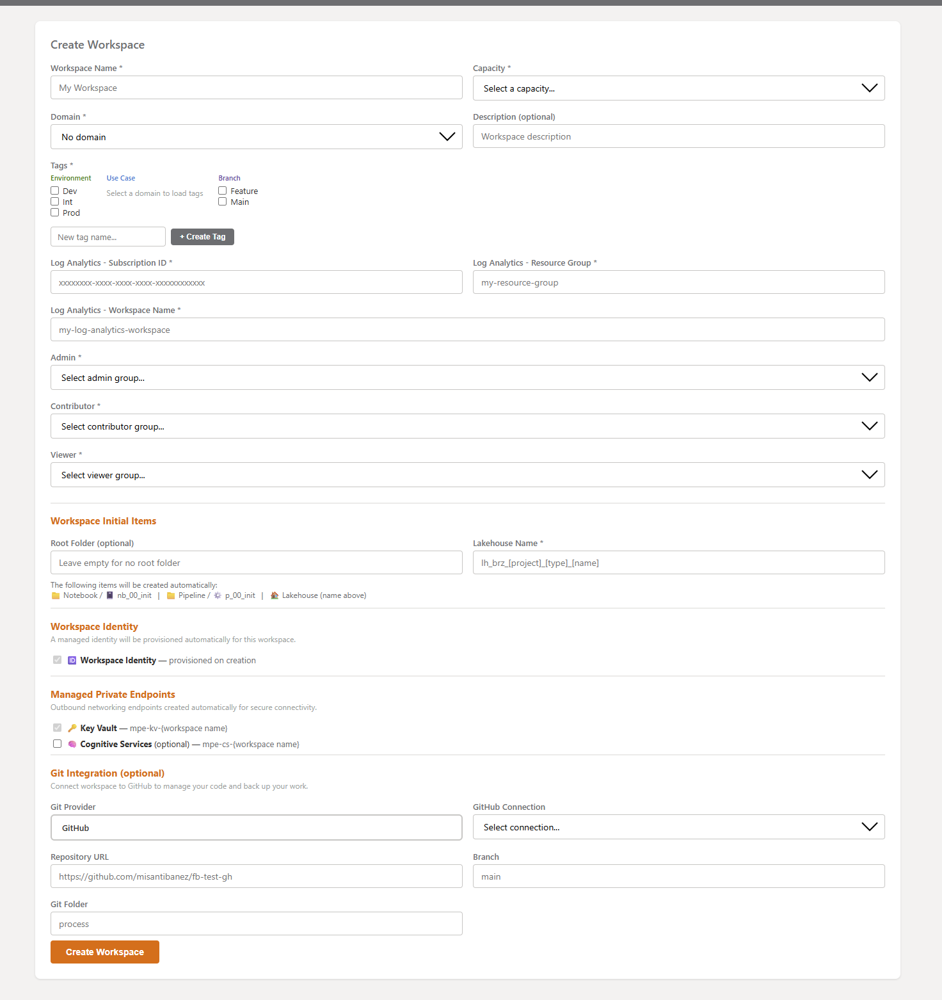
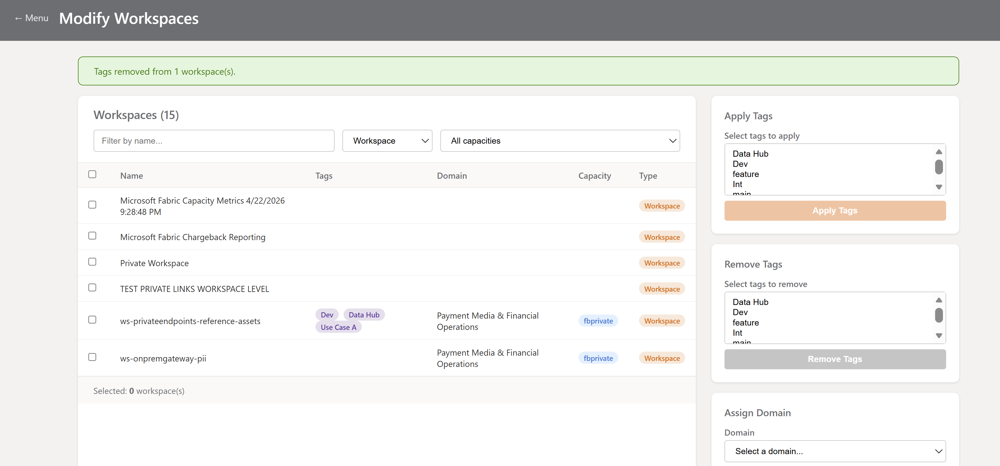
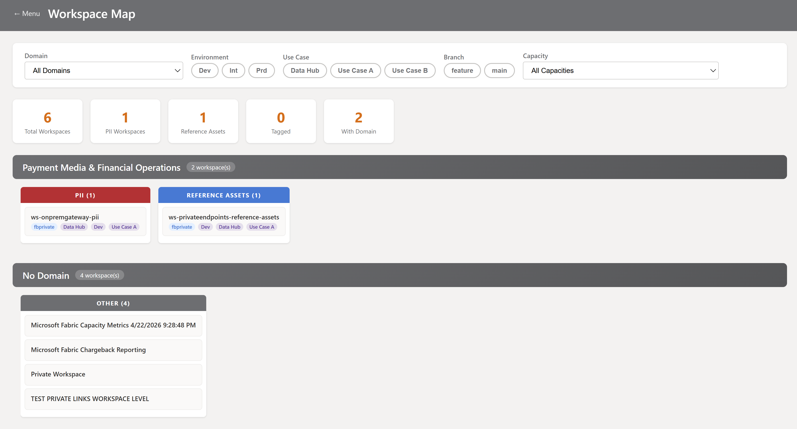
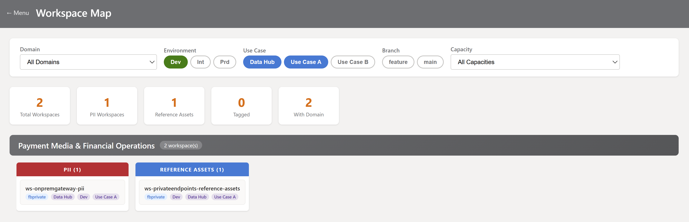
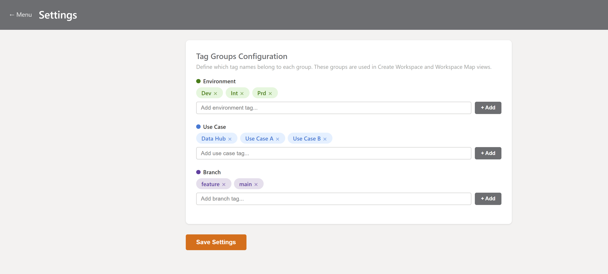
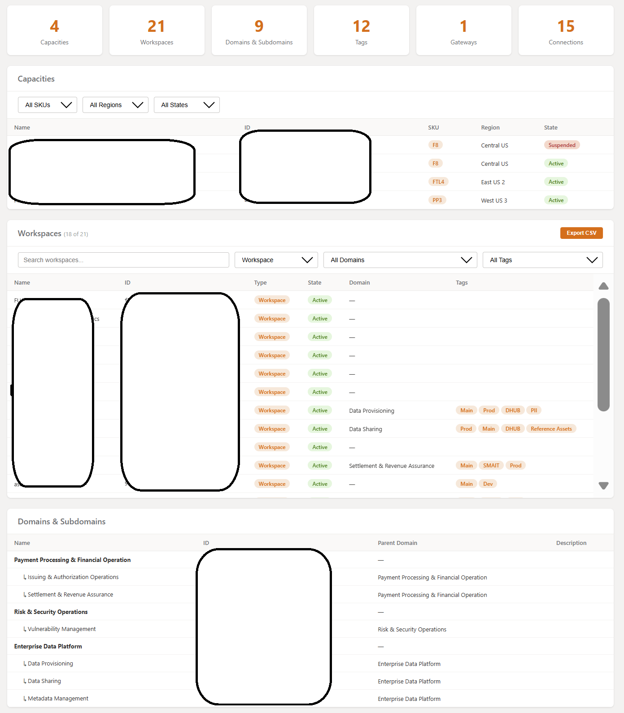
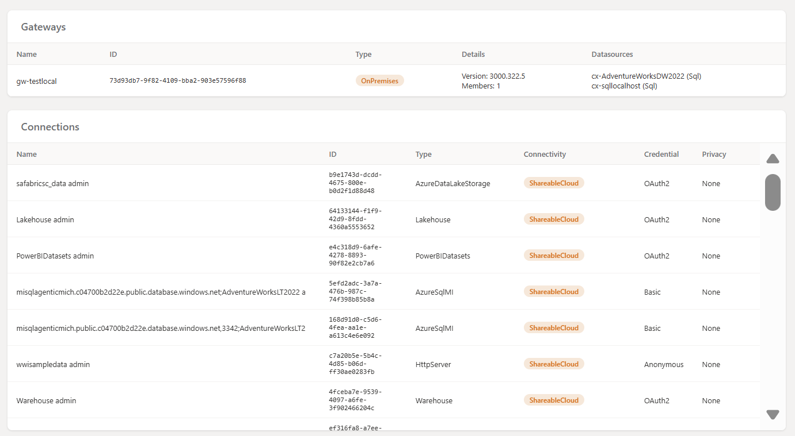
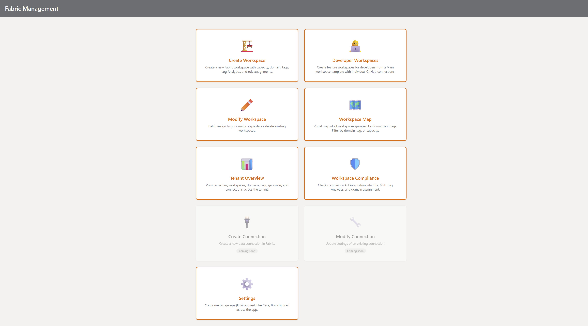

# Fabric Governance Hub

> **Provision, govern, and visualize your Microsoft Fabric workspaces — in minutes, not hours.**

As your Fabric environment grows, so does the need for consistent, repeatable workspace management. **Fabric Workspace Manager** brings together workspace provisioning, governance, and visualization into a single streamlined experience — helping your team move faster while keeping everything organized.

---

## Who is this for?

- **Fabric Administrators** who want to streamline workspace provisioning across teams
- **Platform Engineers** building standardized data environments across use cases
- **Data Governance Teams** ensuring consistent tagging, domain assignments, and access controls
- **Anyone** looking to accelerate and simplify Fabric workspace management at scale

---

## What can it do?

### Create Workspace — Full Provisioning in One Click
Everything your workspace needs, configured from the start: capacity, domain, tags, Log Analytics, role assignments, workspace identity, managed private endpoints, initial folders, notebooks, pipelines, lakehouse, and GitHub integration — all in a single, guided experience.



### Modify Workspaces — Batch Operations at Scale
Select multiple workspaces and apply changes in bulk: **apply or remove tags**, **assign domains**, **reassign capacity**, or **delete** — all in one streamlined operation, saving time and ensuring consistency.



### Workspace Map — See Your Entire Landscape
Get a **visual overview** of every workspace in your tenant, organized by domain and classified by type (PII, Reference Assets, Use Case). Filter by environment, use case, branch, and capacity to instantly understand your workspace topology.





### Workspace Compliance — Governance at a Glance
Check every workspace against compliance requirements: **Git integration**, **Workspace Identity**, **Managed Private Endpoints** (with approval status), **Log Analytics**, and **Domain assignment**. Filter by any compliance dimension, export to CSV, and track KPIs for compliant vs non-compliant workspaces.

### Settings — Configure Once, Use Everywhere
Define tag groups (Environment, Branch), managed private endpoint resource IDs, and compliance rules in one place. The entire app adapts — Create Workspace forms, Workspace Map filters, and compliance checks all stay consistent.



### Tenant Overview — Everything at a Glance
Capacities, workspaces, domains, subdomains, tags, gateways (with contact info and users), connections — all visible in a single dashboard with filters, search, and CSV export.





---

## Key Capabilities

| Feature | Description |
|---------|-------------|
| **Workspace Provisioning** | Create workspaces with capacity, domain, tags, roles, and initial items in a single step |
| **Workspace Identity** | Automatically provisions a managed identity for each new workspace |
| **Managed Private Endpoints** | Creates Key Vault and Cognitive Services MPEs for secure outbound connectivity |
| **Initial Items** | Auto-create folder structure (Notebook, Pipeline), notebooks (`nb_00_init`), pipelines (`p_00_init`), and Lakehouse |
| **Nested Root Folders** | Support for nested folder paths like `Project/SubProject/` |
| **Tag Management** | Create tags on the fly, apply/remove in batch; Use Case tags loaded dynamically from domain |
| **Domain Assignment** | Assign workspaces to domains and subdomains individually or in bulk |
| **Log Analytics** | Configure Azure Log Analytics workspace integration via Power BI admin API |
| **Role Assignments** | Pre-defined Entra ID security groups per role (Admin, Contributor, Viewer) |
| **Git Integration** | Connect workspaces to GitHub with auto-creation of git folders via GitHub API |
| **Workspace Map** | Visual governance dashboard with domain grouping and PII/Reference Assets classification |
| **Tenant Overview** | Dashboard with KPIs, filters, and CSV export for workspaces and gateways |
| **Dual Token Auth** | Automatic handling of Fabric, Power BI, and GitHub API tokens |
| **Batch Operations** | Apply tags, remove tags, assign domain, assign capacity, delete — across multiple workspaces |

---

## Getting Started

### Prerequisites
- Python 3.8+
- A Microsoft Entra ID account with Fabric workspace admin permissions
- A Fabric tenant with at least one capacity

### Installation

```bash
git clone <repo-url>
cd fb-apis
pip install flask python-dotenv azure-identity requests
```

### Configuration

Create a `.env` file:
```env
FABRIC_TENANT_ID=your-tenant-id
GITHUB_PAT=your-github-personal-access-token
```

- `FABRIC_TENANT_ID` — Your Microsoft Entra tenant ID
- `GITHUB_PAT` — GitHub Personal Access Token with `repo` scope (used to create git folders)

### Run

```bash
python app.py
```

The app uses **Device Code Authentication** — a URL and code will appear in the terminal. Open the URL in your browser, enter the code, and sign in with your Entra ID account.

Then open **http://127.0.0.1:5000** in your browser.



---

## Architecture

```
app.py                        ← Flask app (all routes and API logic)
settings.json                 ← Configuration (auto-generated)
.env                          ← Secrets (tenant ID, GitHub PAT)
templates/
  ├── menu.html               ← Main menu
  ├── index.html              ← Create Workspace form
  ├── tenant_overview.html    ← Tenant Overview dashboard
  ├── workspace_compliance.html ← Compliance checks
  ├── modify_workspaces.html  ← Batch workspace operations
  ├── workspace_map.html      ← Visual workspace map
  └── settings.html           ← Settings page
```

### API Integration
The app consumes two sets of APIs with separate authentication tokens:

| API | Base URL | Token Scope |
|-----|----------|-------------|
| **Fabric** | `api.fabric.microsoft.com` | `https://api.fabric.microsoft.com/.default` |
| **Power BI** | `api.powerbi.com` | `https://analysis.windows.net/powerbi/api/.default` |
| **Microsoft Graph** | `graph.microsoft.com` | `https://graph.microsoft.com/.default` |
| **GitHub** | `api.github.com` | Personal Access Token |

---

## Contributing

This is an internal tool built to accelerate Fabric workspace management. PRs and suggestions welcome.

## License

This project is licensed under the [MIT License](LICENSE).
